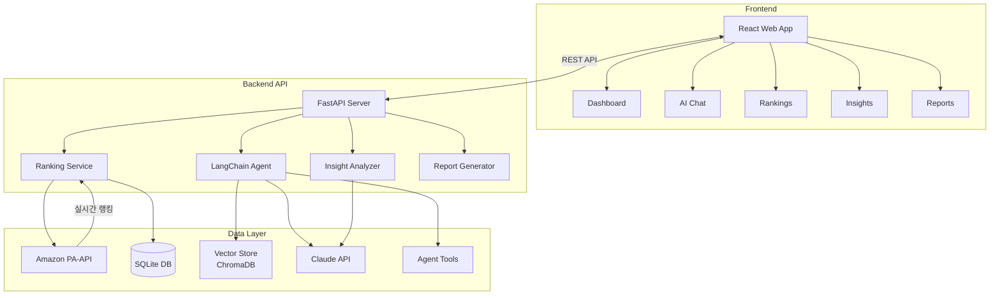
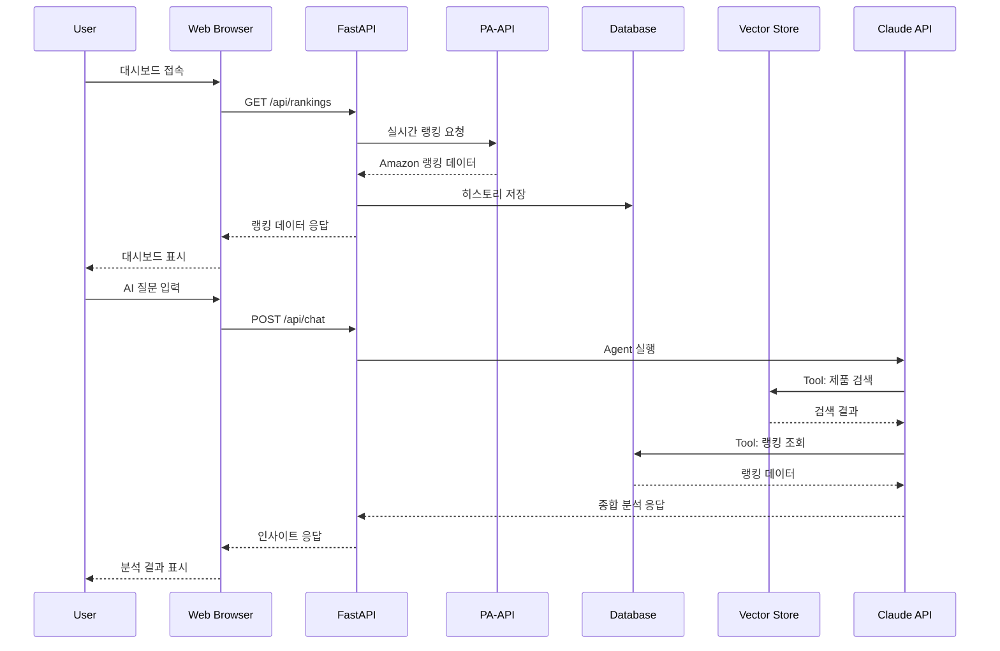

# LANEIGE Ranking Insight Agent


> **아모레퍼시픽 AI INNOVATION CHALLENGE 2026** 공모전 참가작
>
> **[AGENT 07] 글로벌 이커머스 랭킹 모니터링**

글로벌 뷰티 플랫폼(Amazon US, @COSME JP) 내 라네즈 제품의 랭킹을 추적하여
**자동 리포트 생성**과 **대화형 AI 분석**을 제공하는 **AI 인사이트 에이전트**

---

## 프로젝트 소개

### 배경 및 목적

글로벌 뷰티 시장에서 라네즈(LANEIGE)의 경쟁력을 데이터 기반으로 분석하고, 마케팅 의사결정을 지원하기 위한 AI 에이전트입니다.

**핵심 가치:**
- 랭킹 변동 히스토리 자동 수집 및 Excel 형식 저장
- 제품별 성과 AI를 활용하여 자동 인사이트 제공
- 경쟁사 대비 포지셔닝 분석
- 대화형 인터페이스 기반 인사이트 분석 기능 제공

---

## 주요 기능

### 실시간 랭킹 수집

Amazon Product Advertising API(PA-API 5.0)를 통해 실시간 랭킹 데이터를 수집합니다.

**수집 데이터:**
- **Best Sellers Rank**: 카테고리별 베스트셀러 순위
- **제품 정보**: 제품명, 브랜드, 가격, 특징
- **히스토리**: 30일간 일별 순위 변동 기록

**지원 카테고리:**
- Lip Care (립 케어)
- Skincare (스킨케어)
- Face Makeup (페이스 메이크업)
- Face Powder (페이스 파우더)

### 자동 리포트 생성

웹 대시보드에서 버튼 클릭으로 엑셀 리포트를 자동 생성합니다.

**리포트 구성:**
- **Summary Sheet**: 카테고리별 라네즈 성과 요약
- **Category Sheets**: 일자별 전체 제품 랭킹 (조건부 서식 적용)
- **LANEIGE Analysis**: 라네즈 제품 전용 심층 분석

### AI 대화형 분석

**LangChain Agent** 기반으로 자연어 질문에 대한 AI 인사이트를 제공합니다.

**기술 구성:**
- **LangGraph ReAct Agent**: AI가 질문에 따라 적절한 도구를 자동 선택
- **9가지 전문 Tool**: 제품 검색, 랭킹 조회, 경쟁사 비교, 트렌드 분석 등
- **멀티스텝 추론**: 복잡한 질문에 대해 여러 도구를 순차적으로 활용
- Vector DB(ChromaDB)에서 관련 제품 정보 검색

---

## 시스템 아키텍처



### 데이터 흐름



---

## 설치 및 실행 방법

### 1. 환경 요구사항

- Python 3.10 이상
- Node.js 18 이상
- pip, npm 패키지 매니저

### 2. 의존성 설치

```bash
# 저장소 클론
git clone https://github.com/your-repo/amore_ai_agent.git
cd amore_ai_agent

# 가상환경 생성 (권장)
python -m venv venv
source venv/bin/activate  # Windows: venv\Scripts\activate

# 백엔드 패키지 설치
pip install -r requirements.txt

# 프론트엔드 패키지 설치
cd frontend
npm install
cd ..
```

### 3. API 키 설정

```bash
# .env 파일 생성
cp .env.example .env

# .env 파일 편집
ANTHROPIC_API_KEY=your-anthropic-api-key
PA_API_ACCESS_KEY=your-amazon-pa-api-access-key
PA_API_SECRET_KEY=your-amazon-pa-api-secret-key
PA_API_PARTNER_TAG=your-partner-tag
```

### 4. 실행

```bash
# Windows: start.bat 실행
start.bat

# 또는 수동 실행
# 백엔드 (터미널 1)
uvicorn backend.api.main:app --reload --port 8000

# 프론트엔드 (터미널 2)
cd frontend
npm run dev
```

브라우저에서 `http://localhost:3000` 접속

---

## 주요 화면

### 대시보드

실시간 랭킹 현황과 핵심 KPI를 한눈에 확인할 수 있습니다.

- **주요 통계**: 총 제품 수, LANEIGE 제품 수, TOP 5 제품 수, 평균 순위
- **랭킹 차트**: 카테고리별 LANEIGE 제품 순위 추이
- **카테고리 요약**: 각 카테고리별 성과 현황

### 랭킹 분석

Amazon PA-API에서 수집한 실시간 랭킹 데이터를 상세 분석합니다.

- **카테고리별 필터**: Lip Care, Skincare 등 카테고리 선택
- **30일 히스토리**: 일별 순위 변동 추적
- **경쟁사 비교**: LANEIGE vs 경쟁 브랜드 순위 비교

### AI 인사이트

Claude API 기반 RAG 시스템으로 심층 분석을 제공합니다.

- **성과 카드**: 베스트셀러, 급상승 제품, 주요 성과 지표
- **마케팅 카드**: 경쟁 분석, 성장 기회, 액션 플랜
- **트렌드 차트**: 주간 성과 추이, 카테고리별 성장률

### AI 채팅

**LangChain Agent**가 자연어 질문을 분석하고 적절한 도구를 선택하여 인사이트를 제공합니다.

**Agent가 사용하는 Tool:**
- `search_products`: 제품 정보 검색
- `search_laneige_products`: LANEIGE 제품 검색
- `get_product_history`: 제품 순위 히스토리 조회
- `get_category_rankings`: 카테고리별 랭킹 조회
- `get_laneige_summary`: LANEIGE 성과 요약
- `compare_competitors`: 경쟁사 비교 분석
- `analyze_trend`: 트렌드 분석

**질문 예시:**
- "립 슬리핑 마스크 순위가 왜 떨어졌어?"
- "스킨케어 카테고리에서 라네즈 현황은?"
- "경쟁사 대비 우리 제품 강점이 뭐야?"

### 리포트

엑셀 형식의 상세 리포트를 자동 생성하고 다운로드합니다.

- **Summary Sheet**: 카테고리별 LANEIGE 성과 요약
- **Category Sheets**: 일자별 전체 제품 랭킹
- **LANEIGE Analysis**: 심층 분석 데이터

---

## 기술 스택

### Backend

| 구분 | 기술 | 용도 |
|:----:|:-----|:-----|
| **Runtime** | Python 3.10+ | 메인 런타임 |
| **Framework** | FastAPI | REST API 서버 |
| **LLM** | Claude API (Anthropic) | 대화형 분석 생성 |
| **Agent** | LangChain + LangGraph | ReAct Agent 기반 멀티스텝 추론 |
| **Vector DB** | ChromaDB | 시맨틱 검색용 벡터 저장소 |
| **Embedding** | Sentence-Transformers | 텍스트 임베딩 (`all-MiniLM-L6-v2`) |
| **Data** | Pandas | 데이터 처리 및 분석 |
| **Database** | SQLite + SQLAlchemy | 랭킹 히스토리 저장 |
| **Report** | OpenPyXL | 엑셀 리포트 생성 |
| **Ranking API** | Amazon PA-API 5.0 | 실시간 Amazon 랭킹 데이터 |

### Frontend

| 구분 | 기술 | 용도 |
|:----:|:-----|:-----|
| **Runtime** | Node.js 18+ | 프론트엔드 런타임 |
| **Framework** | React 18 | UI 라이브러리 |
| **Language** | TypeScript | 타입 안정성 |
| **Build** | Vite | 빌드 도구 |
| **Styling** | Tailwind CSS | 스타일링 |
| **UI Components** | shadcn/ui | 컴포넌트 라이브러리 |
| **Charts** | Recharts | 데이터 시각화 |

---

<div align="center">

**LANEIGE Ranking Insight Agent**
*Powered by LangChain Agent + Claude API + ChromaDB*

</div>
